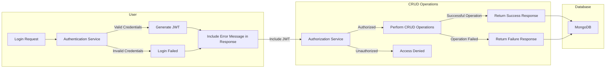

# loopar backend

## Working flow

```mermaid
flowchart LR;
  subgraph User;
    L[Login Request] --> A[Authentication Service];
    A --> |Valid Credentials| B[Generate JWT];
    A --> |Invalid Credentials| E[Login Failed];
    B --> C[Include JWT in Response];
    E --> C[Include Error Message in Response];
  end;

  subgraph CRUD Operations;
    C --> |Include JWT| G[Authorization Service];
    G --> |Authorized| H[Perform CRUD Operations];
    G --> |Unauthorized| F[Access Denied];
    H --> |Successful Operation| I[Return Success Response];
    H --> |Operation Failed| J[Return Failure Response];
  end;

  subgraph Database;
    I --> M[MongoDB];
    J --> M[MongoDB];
  end;
```
